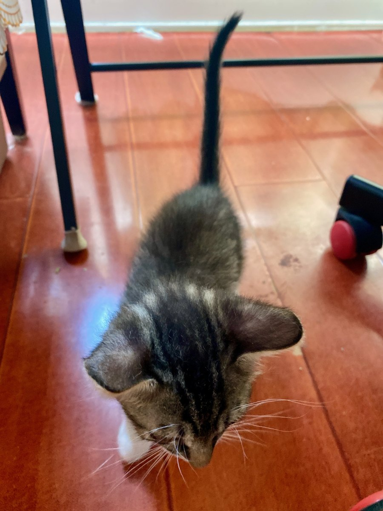

# agent-basics

[中文](README.zh-CN.md)

baby's first coding agent harness.

`agent-basics` sets up a repository so coding agents have a predictable way to keep instructions, memory, and project context consistent.

> **`agent-basics` will add a non-trivial amount of context overhead in exchange for more reliable work.**

## The Problem

Agents are bad at doing extended work due to context limits. As the context window gets bigger, more compacting cycles it went through, agents become less compliant, easier to forget things. A prior user-made decision; a caveat with the codebase; a specific order of operation agents are meant to go through while working, all of these can and will be lost as a project drag on. Unless guide rails ("Harnesses") are in place.

Setting up guide rails is tedious work. From what I've been seeing and communicating with other users, a lot of people are still struggling to find a reliable, systemic guide rail for agentic programming. Markdown files can only do so much, and especially for big projects, markdowns containing memories and project details can balloon, become difficult for agents to read through, or at least cost a lot of context in doing so.

This project aims to help solve this for as many people as possible.

A solution that does not need OpenViking, and therefore does not need a separate LLM and embedding model API, is in the works.

## The Idea

`agent-basics` is a basic repo harness: install one shared memory backend, put stable agent-facing files in predictable places, and teach agents a few repeatable routines.

The repo keeps human-reviewable source files under `.agents/memory/`; OpenViking handles storage, search, and retrieval; MCP gives agents a consistent way to ask for context and record new context. Setup and upgrade keep the structure safe for existing projects, while git hooks keep the memory backend current when committed knowledge changes.

## How It Works

It uses OpenViking as the memory and retrieval backend, which itself needs access to an LLM and an embedding model API for generating structured memory and semantic retrieval. `agent-basics` handles the repo instructions, setup, upgrade, MCP wiring, git hooks, and safe markdown conflict handling. It also manages a user-level OpenViking installation and configures an agent-basics MLX runtime as the default local OpenAI-compatible runtime on Apple Silicon.

## What It Gives You

- A root `Agents.md` that agents can reliably discover.
- A repo-local `.agents/` workspace for agent instructions, skills, memory source files, and OpenViking metadata.
- A user-level OpenViking install, normally under `~/.openviking`, shared across projects.
- Repo-aware MCP tools so agents can search and record project context through OpenViking.
- Git hooks that refresh OpenViking when repo memory files change.
- A safer setup and upgrade flow for existing projects, including markdown merge prompts.
- A supervised git commit helper that uses the configured coding-agent author.

## Install

```bash
brew tap le0-VV/agent-basics https://github.com/le0-VV/agent-basics.git
brew install --HEAD le0-VV/agent-basics/agent-basics
```

The Homebrew install bootstraps the shared OpenViking installation under `~/.openviking`, packages its server as `~/.openviking/openviking`, writes default config when missing, and attempts to install the macOS LaunchAgent. For the first release, the bundled local MLX runtime requires an Apple Silicon Mac with at least 16 GB unified memory. On supported hosts, Homebrew configures OpenViking for the agent-basics MLX runtime at `http://127.0.0.1:18080/v1`, with `mlx-community/gemma-4-e2b-it-4bit` for chat/VLM routing and `mlx-community/embeddinggemma-300m-4bit` for embeddings. The MLX bootstrap packages the runtime server as `~/.agent-basics/mlx/agent-basics-mlx`; the LaunchAgent preloads and warms both models after startup and runs a small OpenViking structured-output check.

Verify the command:

```bash
agent-basics --version
agent-basics doctor --online
```

## Set Up A Repo

For a new or existing project:

```bash
agent-basics setup /path/to/project
```

Re-running setup is the upgrade path:

```bash
agent-basics upgrade /path/to/project
```

If setup finds existing markdown files such as `Agents.md`, it asks whether to keep, replace, append, manually merge, use the local web merge UI, or save the incoming file beside the original.

## OpenViking

OpenViking is required (for now) and is bootstrapped during Homebrew install. To repair or rerun the full local runtime setup:

```bash
agent-basics ov bootstrap-system
agent-basics mlx bootstrap
agent-basics ov doctor
```

On macOS, bootstrap installs OpenViking as a user LaunchAgent so live search, ingest, and MCP calls can use the same always-on server. Foreground server mode is mainly for debugging:

```bash
agent-basics ov service status
agent-basics ov service restart
agent-basics ov package-server --dry-run
agent-basics ov server
```

Useful commands:

```bash
agent-basics ov status
agent-basics ov import-repo-memory --write
agent-basics ov search "what did we decide about memory?"
agent-basics ov record
agent-basics ov add-resource ./docs/api.md
agent-basics ov add-skill .agents/skills/finish-work.md
agent-basics ov ingest-changed
agent-basics ov install-hooks
```

## MCP Setup

Configure your MCP client to run `agent-basics mcp`. Do not pin the server to a project directory; agents pass their current working directory as the `cwd` tool argument.

Example:

```json
{
    "mcpServers": {
        "agent-basics": {
            "command": "agent-basics",
            "args": ["mcp"]
        }
    }
}
```

For Codex Desktop:

- Name: `agent-basics`
- Transport: `STDIO`
- Command: `agent-basics`
- Arguments: `mcp`
- Working directory: leave unset/default
- Tool calls: pass `cwd` as the repository root or any directory inside it

## Daily Use

Validate and commit:

```bash
agent-basics verify
agent-basics commit "feat(scope): description"
```

The commit helper stages nothing by itself. Stage the intended files first, then commit.

## Repo Layout

After setup, a project usually has:

```text
.
├── Agents.md
├── ROADMAP.md
├── Skills.md
└── .agents/
    ├── AGENT-BASICS.md
    ├── TODO.md
    ├── config.toml
    ├── openviking/
    ├── memory/
    ├── skills/
    ├── merge-sessions/
    └── backups/
```

Key files:

- `Agents.md`: root instructions agents should read first.
- `.agents/AGENT-BASICS.md`: operating notes for the agent-basics workflow.
- `.agents/memory/`: repo-owned memory and resource files that OpenViking ingests.
- `.agents/openviking/`: repo metadata, import state, locks, and migration records.
- `.agents/skills/` and `Skills.md`: repeatable workflows for agents.
- `.agents/TODO.md`: current work checklist; ignored by git.

## Local Runtime

The default local setup uses `agent-basics-mlx`, an agent-basics-managed MLX executable. First-release local MLX support requires an Apple Silicon Mac with at least 16 GB unified memory. Bootstrap packages the Python MLX server into a one-file executable with PyInstaller, starts it with macOS, preloads the chat/VLM and embedding models, keeps them warm, and clears transient MLX runtime cache after each request.

```bash
agent-basics mlx status
agent-basics mlx bootstrap
agent-basics mlx package --dry-run
agent-basics-mlx --version
agent-basics mlx pull --dry-run
```

External OpenAI-compatible APIs are configured as custom providers instead of provider-specific commands:

```bash
agent-basics ov write-default-config \
  --provider custom \
  --base-url http://127.0.0.1:8000 \
  --chat-model your-chat-model \
  --embedding-model your-embedding-model \
  --api-key your-api-key
```

## If you need any help

Please clone this repo and ask your agent how to best use it.

## 👉👈

If agent-basics helped you in any way, or you're just feeling generous, and you have Alipay, please consider making a small donation to this project. Even 1 fen means a world of encouragement to me.


Also bro's got no source of income right now 💀. Your donation will help me feed my 2 fur babies: Jessie and Yolo <3

This is completely voluntary. It does not change the license, issue priority, feature priority, or support expectations.

### Jessie and Yolo

| Jessie, first day                                                                      | Jessie                                                        | Also Jessie                                                        |
| -------------------------------------------------------------------------------------- | ------------------------------------------------------------- | ------------------------------------------------------------------ |
|  |  |  |

| Smol Yolo                                                         | Yolo                                                      | Still Yolo                                                      | Jessie and Yolo                                                                        |
| ----------------------------------------------------------------- | --------------------------------------------------------- | --------------------------------------------------------------- | -------------------------------------------------------------------------------------- |
|  |  |  |  |

## More Detail

- [ROADMAP.md](ROADMAP.md): direction and open design questions.
- [Agents.md](Agents.md): root agent instructions for this repository.
- [.agents/AGENT-BASICS.md](.agents/AGENT-BASICS.md): agent-basics operating details.
